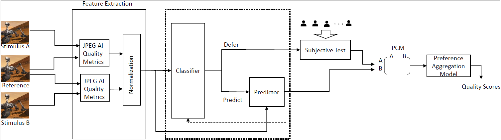

# Predictive Sampling for Efficient Pairwise Subjective Image Quality Assessment
An offline sampling strategy for pair reduction in pairwise subjective test

Shima Mohammadi, João Ascenso

Instituto de Telecomunicações, Instituto Superior Técnico, University of Lisbon
[Download](https://arxiv.org/abs/2311.03850) the paper

## About the Paper
<p align="justify">
Subjective image quality assessment studies are used in many scenarios, such as the evaluation of compression, super-resolution, and denoising solutions. Among the available subjective test methodologies, pair comparison is attracting popularity due to its simplicity, reliability, and robustness to changes in the test conditions, e.g. display resolutions. The main problem that impairs its wide acceptance is that the number of pairs to compare by subjects grows quadratically with the number of stimuli that must be considered. Usually, the paired comparison data obtained is fed into an aggregation model to obtain a final score for each degraded image and thus, not every comparison contributes equally to the final quality score. In the past years, several solutions that sample pairs (from all possible combinations) have been proposed, from random sampling to active sampling based on the past subjects’ decisions. This paper introduces a novel sampling solution called Predictive Sampling for Pairwise Comparison (PS-PC) which exploits the characteristics of the input data to make a prediction of which pairs should be evaluated by subjects. The proposed solution exploits popular machine learning techniques to select the most informative pairs for subjects to evaluate, while for the other remaining pairs, it predicts the subjects’ preferences. The experimental results show that PS-PC is the best choice among the available sampling algorithms with higher performance for the same number of pairs. Moreover, since the choice of the pairs is done a priori before the subjective test starts, the algorithm is not required to run during the test and thus much more simple to deploy in online crowdsourcing subjective tests.
</p>

Below is an illustration of the framework:



## How to Set Up

##### 1. Set Python Path:
Navigate to the project directory and add the `src` directory to your `PYTHONPATH` using the following command:
```
export PYTHONPATH=${PWD}
```
## How to Run the Code
### Training
#####  1. Classifier Training / Predictor Training:
The trained models for:
- Classifier (SVM and XGBoost) are stored in: `src/training/Trained models/CLF`
- Predictor are stored in: `src/training/Trained models/Predictor`


If you wish to train the models from scratch, use the provided scripts:
- Classifier training script : `src/Training/CLF_training`
- Predictor training script: `src/Training/Predictor_training`

#####  2. Ground-truth Data Creation:
The ground truth labels can be obtained by running the following script: 
  `src/training/Groundtruth_data_collection/labeling.py`

### Performance Evaluation
#####  1. Labeling Evaluation:
Three labeling procedures were proposed and compared in this paper. To compare them, navigate to: `src/Performance_Evaluation/labeling_compare` 
#####  2. Ablation Study:
To evaluate different components of the framework, navigate to: `src/Ablation_study and run ablation_study`

# Citation
```
@inproceedings{mohammadi2023predictive,
  title={Predictive Sampling for Efficient Pairwise Subjective Image Quality Assessment},
  author={Mohammadi, Shima and Ascenso, Jo{\~a}o},
  booktitle={Proceedings of the 31st ACM International Conference on Multimedia},
  pages={6676--6684},
  year={2023}
}
```

# Acknowledgements
This work is funded by FCT/MCTES through national funds and when applicable co-funded EU funds under the project DARING with reference PTDC/EEI-COM/7775/2020.
